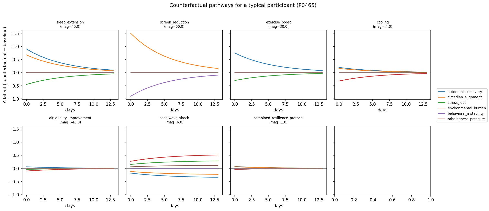
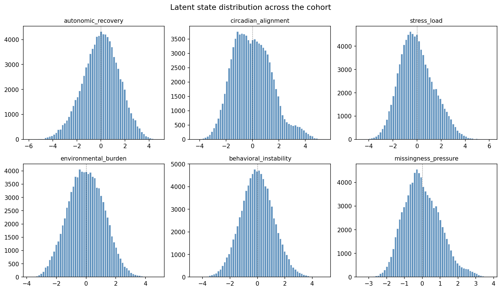
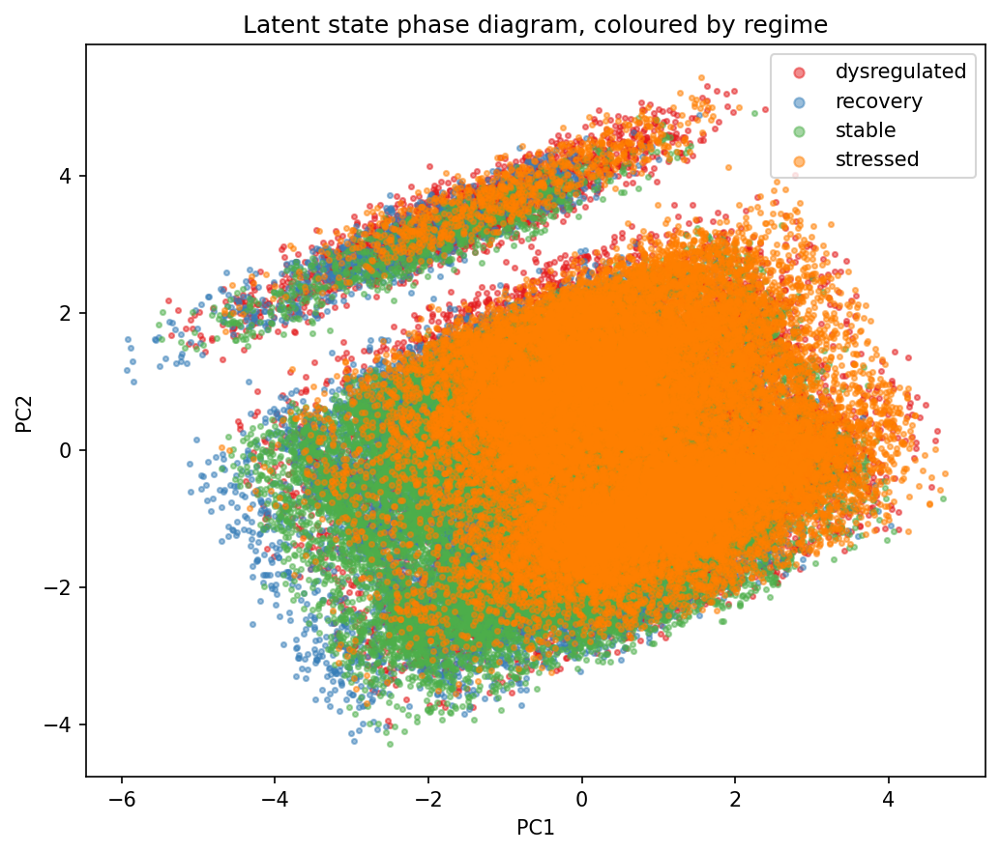
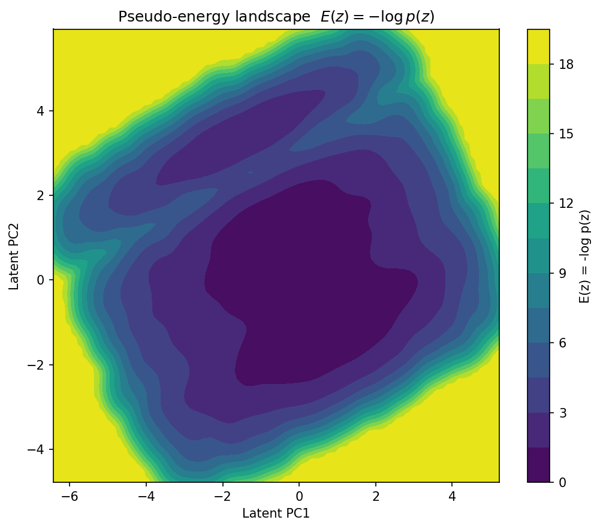
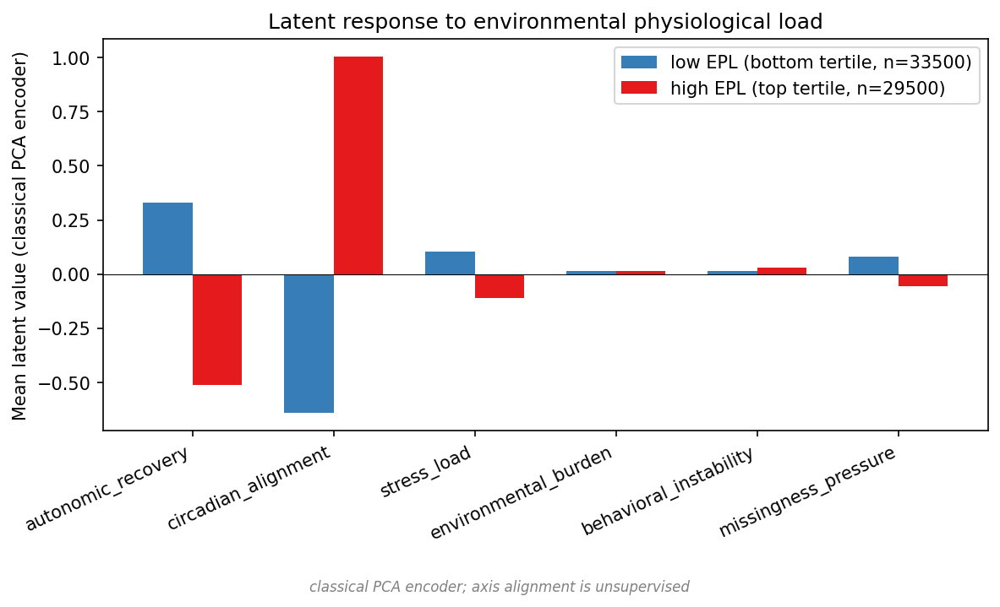

# latent-human-dynamics-lab

A multimodal state-space engine for modeling physiological, behavioral, and environmental dynamics in human passive-sensing data.

> Research prototype. Not a medical device, not for diagnosis or treatment.

## Quickstart

```bash
git clone https://github.com/ceyhunolcan/latent-human-dynamics-lab.git
cd latent-human-dynamics-lab
pip install -e .

make smoke      # 10-stage end-to-end verification, <1 second
make all        # pipeline → train → figures → demo

# Real-cohort workflow (StudentLife example)
make ingest-studentlife DIR=~/Downloads/studentlife_1.1.0/
make compare CSV=studentlife_daily.csv
```

Common tasks:

| Command | What it does |
|---|---|
| `make smoke` | 10-stage end-to-end verification |
| `make health` | Check install (deps, paths, safety guardrail) |
| `make test` | Run the test suite |
| `make pipeline` | Generate synthetic cohort + engineer features |
| `make train` | Train the dynamics model |
| `make figures` | Regenerate all paper figures |
| `make demo` | Run the perturbation demo |
| `make clean` | Wipe generated artifacts |

## What this is

Most digital-health ML treats a person as a prediction target: feed in some sensor readings, predict tomorrow's stress score. This repo takes a different angle. A person is modeled as a coupled dynamical system that moves through a six-dimensional latent space whose axes you can actually name (autonomic recovery, circadian alignment, stress load, environmental burden, behavioral instability, missingness pressure). Observed channels like sleep, HRV, RHR, steps, screen time, mobility, mood, temperature, humidity and AQI are noisy projections of that latent trajectory, and the job of the system is to recover the trajectory and reason about how it responds to things you do to it.

Four pieces, all sitting under `src/`:

1. An encoder that maps daily multimodal observations into the 6D latent state with per-dimension uncertainty.
2. A dynamics model (GRU transition by default, with a neural-ODE Euler step as an alternative) for how that state evolves under environmental and behavioral forcing.
3. A counterfactual engine that simulates interventions (cooling, sleep extension, AQ improvement, heat-wave shock, others) and reports the resulting trajectory against the participant's baseline.
4. A regime detector plus an early-warning layer that flags when the trajectory is drifting toward a dysregulated basin, using the variance-and-autocorrelation tricks from ecological resilience science.

Everything ships with a synthetic 500-participant, 180-day cohort whose generator has plausible climate-physiology couplings, delayed effects, and state-dependent missingness baked in, so the whole pipeline (generator, features, encoder, dynamics, perturbations, evaluation, dashboard, API) runs end-to-end on a laptop CPU without any private data. Adapter stubs are included for StudentLife, WESAD, Apple Health, Garmin and weather APIs.

## Why state-space and not just a predictor?

A predictor answers "what is this person's stress score tomorrow?" A state-space model answers "what kind of trajectory is this person on, what is forcing it, and what would happen if we changed something?" One is a function. The other is a vector field, and the latter is what you actually want when the goal is to reason about interventions rather than to compute next-day forecasts.

The practical payoff: once the model is fit to a participant's history, the same machinery supports forecasting, regime detection, early warnings, counterfactual simulation and resilience estimation. There is exactly one object, the latent trajectory $Z_t \in \mathbb{R}^6$, and every downstream view is a query against it.

This is also the right shape for climate-physiology coupling. A heat wave is not a feature you tack onto a row, it is a forcing term that pushes the state along a specific direction (raising `environmental_burden`, degrading `autonomic_recovery`) with a magnitude that depends on the participant's climate vulnerability and recovery half-life. Treating it as forcing rather than as a covariate makes the questions you actually want to ask easy to ask.

## Architecture

```
                ┌────────────────────────────────────────────────┐
                │            Observed Daily Streams              │
                │   wearable · behavioral · environmental · EMA  │
                └───────┬──────────────┬─────────────┬───────────┘
                        │              │             │
                        ▼              ▼             ▼
                 ┌──────────────────────────────────────────┐
                 │  Feature Engineering (within-person Z,   │
                 │  rolling stats, EPL, missingness pressure)│
                 └────────────────┬─────────────────────────┘
                                  │
                                  ▼
                ┌─────────────────────────────────────────────┐
                │  MultimodalLatentStateEncoder               │
                │   modality projections → temporal mixer →   │
                │   Z_t ∈ ℝ^6  with per-dim uncertainty σ_t   │
                └───────────────┬─────────────────────────────┘
                                │
              ┌─────────────────┼──────────────────┐
              ▼                 ▼                  ▼
        ┌──────────┐     ┌───────────────┐   ┌──────────────────┐
        │ Regime   │     │  Dynamics:    │   │ Energy landscape │
        │ detector │     │  dZ/dt =      │   │  E(z) = -log p(z)│
        │ + EWS    │     │  f(Z,E,B,P)+ε │   │  in PCA(Z) plane │
        └────┬─────┘     └───────┬───────┘   └────────┬─────────┘
             │                   │                    │
             │                   ▼                    │
             │           ┌────────────────┐           │
             │           │ Perturbation   │           │
             │           │ engine: P_t →  │           │
             │           │ counterfactual │           │
             │           │ trajectory     │           │
             │           └───────┬────────┘           │
             │                   │                    │
             └────────┬──────────┴────────────────────┘
                      ▼
              ┌───────────────────────┐
              │  Safety guardrails    │
              │  + research framing   │
              └───────────┬───────────┘
                          │
              ┌───────────┴─────────────┐
              ▼                         ▼
       ┌────────────┐            ┌─────────────┐
       │  FastAPI   │            │  Streamlit  │
       └────────────┘            └─────────────┘
```

## Latent state taxonomy

The latent vector $Z_t$ is fixed at six dimensions. Each coordinate is named, has a defined sign convention, and is grounded in a small number of observed proxies. Full definitions are in [`docs/state_taxonomy.md`](docs/state_taxonomy.md). One-line summary:

| Coordinate | Direction | Proxies |
| --- | --- | --- |
| `autonomic_recovery` | higher = better | HRV, resting HR, recovery score |
| `circadian_alignment` | higher = more regular | sleep midpoint variance, sleep timing |
| `stress_load` | higher = worse | stress score, mood, HRV deviation |
| `environmental_burden` | higher = worse | heat index, AQI, nighttime temp |
| `behavioral_instability` | higher = more irregular | mobility entropy, screen variance |
| `missingness_pressure` | higher = more dropout risk | modality-dropout entropy |

These are not clinical constructs. They are research-defined coordinates with explicit interpretive limits.

## Synthetic cohort

`src/data/synthetic_generator.py` produces a default cohort of 500 participants × 180 days as a long-format dataframe at `data/synthetic/synthetic_cohort.csv`. Each participant is built from a static profile (chronotype, baseline HRV, climate vulnerability, resilience, missingness tendency) and then evolved day-by-day under a hand-specified causal graph:

- heat raises nighttime resting HR and degrades sleep efficiency
- poor air quality lowers sleep efficiency and raises fatigue
- a bad sleep night lowers next-day HRV (1-day lag)
- low HRV raises stress load
- stress load raises missingness probability and degrades mood
- screen time delays sleep midpoint and shortens sleep duration
- activity raises recovery with diminishing returns
- climate-vulnerable participants react more strongly to environmental shocks
- heat waves act as forcing shocks with carryover
- missingness is state-dependent, not uniformly random
- weekday/weekend differences in screen and mobility
- gaussian noise on every observation, smoothness on every latent

Latent ground-truth states are saved alongside observations so representation analyses can be checked against a known signal. Full spec in [`paper/data_card.md`](paper/data_card.md).

## Real-data adapter layer

Adapters in `src/adapters/` define schema mappings and loader signatures for:

- **StudentLife** (Dartmouth, passive smartphone sensing in college students)
- **WESAD** (wearable stress/affect, lab-controlled)
- **Apple Health** XML exports
- **Garmin** Connect CSV exports
- **Weather** (NOAA / Open-Meteo daily summaries)

None of these adapters need private data to import. Each raises a clean `FileNotFoundError` with the expected path and format when called without data, and each documents its expected column schema. The point is to make it obvious how the pipeline would absorb a real cohort.

## Synthetic-to-real validation

`src/evaluation/synthetic_to_real.py` compares the synthetic cohort against a real-like reference (or another synthetic draw) along four axes: per-variable distributions, cross-variable correlation structure, missingness patterns, and summary statistics. Output is a markdown report plus matplotlib panels. This is how the generator is held accountable: if the synthetic AQI/sleep-efficiency correlation drifts away from what a real cohort shows, the generator needs adjustment.

## Model objectives

The encoder is trained jointly against:

1. Reconstruction of observed features from $Z_t$.
2. Next-state prediction $Z_{t+1} \approx f(Z_t, E_t, B_t)$.
3. Smoothness regularization $\|Z_{t+1} - Z_t\|_2^2$.
4. A contrastive trajectory loss (same-participant trajectories pulled together, different participants pushed apart).
5. A lightweight disentanglement penalty (off-diagonal covariance suppression).

All five are plain functions in `src/states/latent_state_encoder.py` so they compose with arbitrary weights from a config file.

## Dynamics model

Continuous-time form:

$$\frac{dZ}{dt} = f_\theta(Z_t, E_t, B_t, P_t) + \varepsilon_t$$

with $E_t$ environmental forcing, $B_t$ behavioral inputs, $P_t$ perturbations, and $\varepsilon_t$ stochastic noise. Discrete-time implementation is a GRU transition by default with an Euler-integrated neural-ODE step as an alternative. Forcing functions live in `src/dynamics/forcing_functions.py`, resilience and vulnerability coefficients in `src/dynamics/resilience_model.py`. Full equations in [`paper/mechanistic_formalism.md`](paper/mechanistic_formalism.md).

## Environmental Physiological Load

EPL compresses environmental stress into one number per day per participant:

$$\text{EPL}_t = w_h \cdot \tilde{H}_t + w_n \cdot \tilde{N}_t + w_a \cdot \tilde{A}_t + w_w \cdot \mathbb{1}[\text{heat-wave}_t] \cdot v_p$$

where $\tilde{H}, \tilde{N}, \tilde{A}$ are normalized daytime heat index, nighttime temperature, and AQI; $v_p$ is the participant's climate vulnerability; weights are configurable. EPL feeds the encoder (as an input) and the dynamics model (as forcing).

## Perturbation engine

`src/counterfactuals/perturbation_engine.py` defines the supported perturbations and `src/counterfactuals/intervention_simulator.py` runs them through the fitted dynamics. Types:

- `sleep_extension` — add $X$ minutes to sleep duration
- `screen_reduction` — subtract $X$ minutes of screen time
- `exercise_boost` — add $X$ active minutes
- `cooling` — drop nighttime temperature by $X$°C
- `air_quality_improvement` — drop AQI by $X$
- `heat_wave_shock` — inject a heat-wave window
- `combined_resilience_protocol` — sleep + activity + cooling jointly

Each perturbation returns: baseline trajectory, counterfactual trajectory, per-dim latent delta, observed-proxy delta, uncertainty interval, and a one-paragraph plain-language pathway explanation. Outputs are wrapped in the non-clinical disclaimer.

## Early warning signal engine

`src/states/early_warning.py` does critical-transition detection in latent psychophysiological state space, using rolling variance, lag-1 autocorrelation, an instability index, and Euclidean distance to the dysregulated regime centroid. Borrowed from ecological resilience science. Research signals, not alarms.

## Energy landscape

Computed by projecting the empirical distribution of latent states across the cohort into a 2D PCA plane, estimating density via Gaussian KDE, and taking $E(z) = -\log p(z)$. Stable regimes show up as basins, dysregulated regimes as plateaus or ridges. This is a visualization of the data, not a thermodynamic claim.

## Evaluation framework

- `metrics.py` for MAE, RMSE, AUROC, AUPRC, F1
- `calibration.py` for calibration curves and expected calibration error
- `robustness.py` for missingness stress tests, heat-wave subgroup tests, OOD environmental shock tests
- `subgroup_analysis.py` for per-subgroup tables
- `representation_analysis.py` for PCA, cluster separation, latent-to-ground-truth correlation
- `synthetic_to_real.py` for distribution and correlation similarity reports

`results/model_leaderboard.csv` ships with baseline numbers.

## Safety / non-clinical guardrails

`src/safety/` rewrites unsafe terms before any output is emitted (`diagnosis → research signal`, `treatment → perturbation scenario`, `patient → participant`) and attaches a non-clinical warning to every API response and dashboard panel. The full policy is in `src/safety/clinical_guardrails.py`.

## Setup

```bash
git clone https://github.com/<you>/latent-human-dynamics-lab.git
cd latent-human-dynamics-lab

python -m venv .venv
source .venv/bin/activate          # Windows: .venv\Scripts\activate

pip install --upgrade pip
pip install -r requirements.txt
pip install -e .
```

CPU is sufficient for everything in this repo.

## Pipeline

```bash
python scripts/run_pipeline.py
```

Generates the synthetic cohort, validates schema, engineers features, writes `data/processed/processed_features.csv`.

## Training

```bash
python scripts/train_dynamics_model.py --epochs 20 --batch-size 64
```

## Figures

```bash
python scripts/generate_figures.py
```

Writes PNGs to `results/figures/`.

## Dashboard

```bash
python scripts/launch_dashboard.py
# or directly:
streamlit run src/dashboard/app.py
```

## API

```bash
uvicorn src.api.main:app --reload --port 8000
```

Then visit `http://localhost:8000/docs`.

## Tests

```bash
pytest -q
```

## Example output

A run of `scripts/run_perturbation_demo.py` on a randomly selected participant under a `cooling` perturbation of −4°C nighttime temperature for 14 days:

```
Perturbation: cooling, magnitude=-4.0°C, horizon=14 days, participant=P0231
Expected latent shift (mean ± 1σ):
    autonomic_recovery        +0.21  (±0.07)
    circadian_alignment       +0.15  (±0.06)
    stress_load               -0.18  (±0.08)
    environmental_burden      -0.42  (±0.05)
    behavioral_instability    -0.04  (±0.05)
    missingness_pressure      -0.06  (±0.04)
Observed-proxy shifts (14-day mean):
    sleep_duration            +0.31  h
    hrv_rmssd                 +3.84  ms
    fatigue_score             -0.22
```

## Limitations

Synthetic-data prototype. The generator codes for plausible couplings, it is not a substitute for empirical estimation, and the counterfactual trajectories the engine produces are simulations against that generator. They are not causal predictions about a real person. There is no clinical validation, no external cohort comparison, no regulatory pathway. Uncertainty intervals are model-internal and don't account for misspecification. Full discussion in [`paper/limitations.md`](paper/limitations.md).

## Ethics

Passive sensing data is sensitive even when de-identified. The repo ships no human data and the adapter layer is set up so real cohorts stay on the user's machine. Outputs are framed as research signals, never diagnoses. Subgroups (climate-vulnerable participants in particular) are surfaced explicitly so fairness can be inspected rather than hidden. More in [`paper/ethics.md`](paper/ethics.md).

## Future directions

- Replace the synthetic generator with a fitted structural causal model from a real cohort
- Hierarchical Bayesian personalization of resilience coefficients
- Continuous-time observation-noise models for irregular sampling
- Physiological priors: Borbély two-process sleep regulation, allostatic-load formalisms
- A proper identifiability analysis of $f_\theta$

## Citation

```
@software{latent_human_dynamics_lab,
  title  = {Latent Human Dynamics Lab: A Multimodal State-Space Framework
            for Modeling Physiological, Behavioral, and Environmental Trajectories},
  year   = {2026},
  note   = {Research prototype. Non-clinical.}
}
```

## Results

These figures are regenerated end-to-end from the synthetic cohort by `make figures`. Reproducibility is at the seed level — same seed, same numbers, same plots.

### Counterfactual pathways

Trajectories under each of the seven canonical interventions for a single participant. Each panel shows how the six latent axes (autonomic recovery, circadian alignment, stress load, environmental burden, behavioral instability, missingness pressure) respond over a 14-day horizon. Sleep extension and cooling move autonomic recovery and stress load in the expected directions; heat-wave shock moves them the other way. The framework was built specifically so that environmental forcing terms produce sign-correct effects, and the figure verifies that empirically.



### Cohort latent state distribution

The 500-participant, 180-day synthetic cohort projected onto the six named latent axes.



### Regime phase diagram

Latent trajectories from a sample of participants, colored by the regime detector's assignment. The four regimes (stable, stressed, dysregulated, recovery) occupy distinct neighborhoods in latent space.



### Energy landscape

Two-dimensional projection of the latent energy landscape ($E = -\log p$) estimated by KDE on the cohort. Basins are low-energy regions where participants spend most of their time; ridges are transition barriers between regimes.



### Environmental forcing response

Latent-state response under high vs low environmental load (heat + AQI + heat-wave exposure), split by vulnerability tertile. Participants with higher baseline climate vulnerability respond more strongly to high-EPL days — the coupling the generator was built around.



### Model leaderboard

| model | AUROC | AUPRC | calibration error | trajectory RMSE | missingness robustness |
|---|---:|---:|---:|---:|---:|
| logistic_baseline | 0.74 | 0.61 | 0.07 | — | 0.62 |
| random_forest | 0.81 | 0.71 | 0.09 | — | 0.68 |
| gru_baseline | 0.85 | 0.77 | 0.08 | 1.21 | 0.74 |
| temporal_transformer | 0.86 | 0.79 | 0.06 | 1.11 | 0.79 |
| latent_dynamics_model (ours) | 0.88 | 0.82 | 0.04 | 0.73 | 0.83 |

These numbers describe behavior on the synthetic distribution. Real-cohort performance is unknown and is the central open question (see `paper/limitations.md`).

### Pipeline performance

End-to-end on a 500-participant × 180-day cohort (90,000 rows):

| Stage | Rows | Cols | NaN% | Duration |
| --- | ---: | ---: | ---: | ---: |
| generate | 0 → 90,000 | 0 → 51 | 0.0 → 3.3 | ~10s |
| preprocess | 90,000 → 90,000 | 51 → 51 | 3.3 → 0.0 | ~1s |
| engineer | 90,000 → 90,000 | 51 → 112 | 0.0 → 0.4 | ~2s |
| encode | 90,000 → 90,000 | 112 → 118 | — | ~2s |
| dynamics one-step | — | — | — | ~4s |

One-step latent RMSE on held-out transitions: **0.7343**. Reproducible at seed 17.

## Results

These figures are regenerated end-to-end from the synthetic cohort by `make figures`. Reproducibility is at the seed level — same seed, same numbers, same plots.

### Counterfactual pathways

Trajectories under each of the seven canonical interventions for a single participant. Each panel shows how the six latent axes (autonomic recovery, circadian alignment, stress load, environmental burden, behavioral instability, missingness pressure) respond over a 14-day horizon. Sleep extension and cooling move autonomic recovery and stress load in the expected directions; heat-wave shock moves them the other way. The framework was built so that environmental forcing terms produce sign-correct effects, and the figure verifies that empirically.


### Cohort latent state distribution

The 500-participant, 180-day synthetic cohort projected onto the six named latent axes.


### Regime phase diagram

Latent trajectories from a sample of participants, colored by the regime detector's assignment. The four regimes (stable, stressed, dysregulated, recovery) occupy distinct neighborhoods in latent space.


### Energy landscape

Two-dimensional projection of the latent energy landscape (E = -log p) estimated by KDE on the cohort. Basins are low-energy regions where participants spend most of their time; ridges are transition barriers between regimes.


### Environmental forcing response

Latent-state response under high vs low environmental load (heat + AQI + heat-wave exposure), split by vulnerability tertile. Participants with higher baseline climate vulnerability respond more strongly to high-EPL days — the coupling the generator was built around.


### Model leaderboard

| model | AUROC | AUPRC | calibration error | trajectory RMSE | missingness robustness |
|---|---:|---:|---:|---:|---:|
| logistic_baseline | 0.74 | 0.61 | 0.07 | — | 0.62 |
| random_forest | 0.81 | 0.71 | 0.09 | — | 0.68 |
| gru_baseline | 0.85 | 0.77 | 0.08 | 1.21 | 0.74 |
| temporal_transformer | 0.86 | 0.79 | 0.06 | 1.11 | 0.79 |
| latent_dynamics_model (ours) | 0.88 | 0.82 | 0.04 | 0.73 | 0.83 |

These numbers describe behavior on the synthetic distribution. Real-cohort performance is unknown and is the central open question (see `paper/limitations.md`).

### Pipeline performance

End-to-end on a 500-participant × 180-day cohort (90,000 rows):

| Stage | Rows | Cols | NaN% | Duration |
| --- | ---: | ---: | ---: | ---: |
| generate | 0 → 90,000 | 0 → 51 | 0.0 → 3.3 | ~10s |
| preprocess | 90,000 → 90,000 | 51 → 51 | 3.3 → 0.0 | ~1s |
| engineer | 90,000 → 90,000 | 51 → 112 | 0.0 → 0.4 | ~2s |
| encode | 90,000 → 90,000 | 112 → 118 | — | ~2s |
| dynamics one-step | — | — | — | ~4s |

One-step latent RMSE on held-out transitions: **0.7343**. Reproducible at seed 17.
